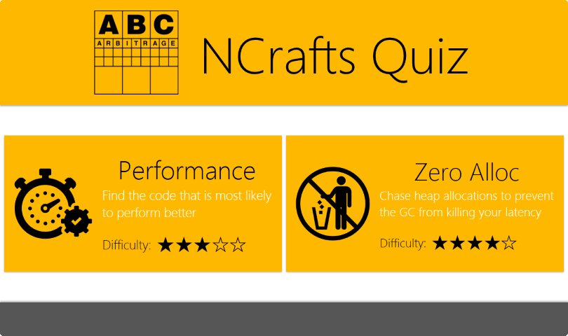
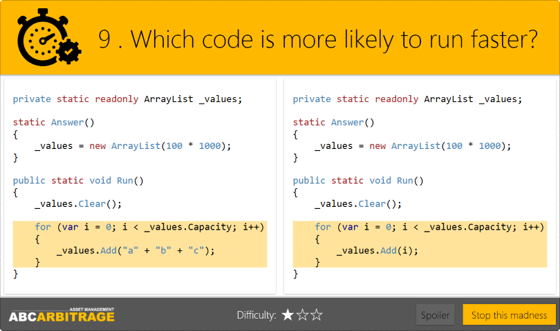
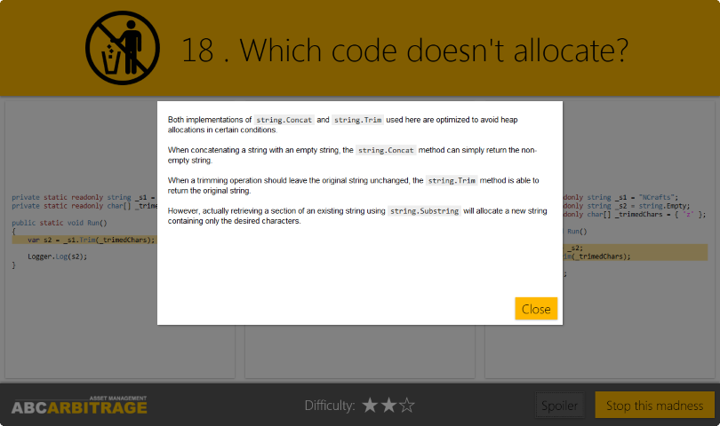

# ABC Arbitrage quiz for NCrafts 2015 & 2016

## Two different quiz in one app

This project is a small quiz application we let people play with on our ABC Arbitrage booth at the two last [NCrafts conference editions](http://ncrafts.io/) in Paris.

You can chose from two different C# quiz :

* A general performance quiz : _Which code is more likely to run faster?_
* A more specific one : _Which code doesn't allocate on heap?_

## Welcome screen

## Chose the good answer

## Get some help

